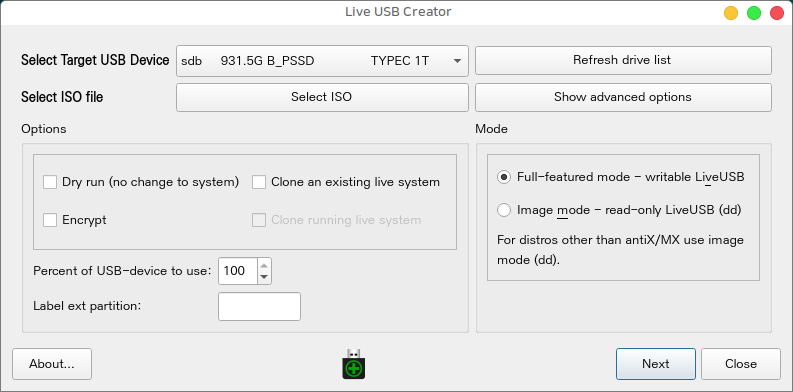
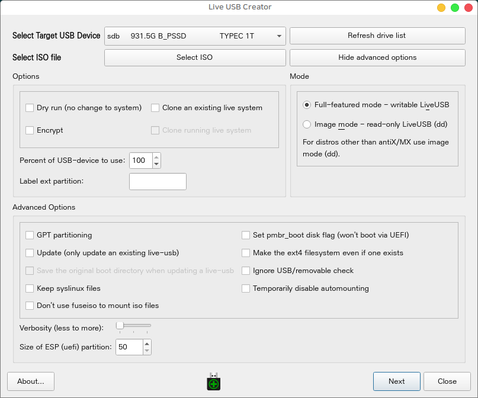
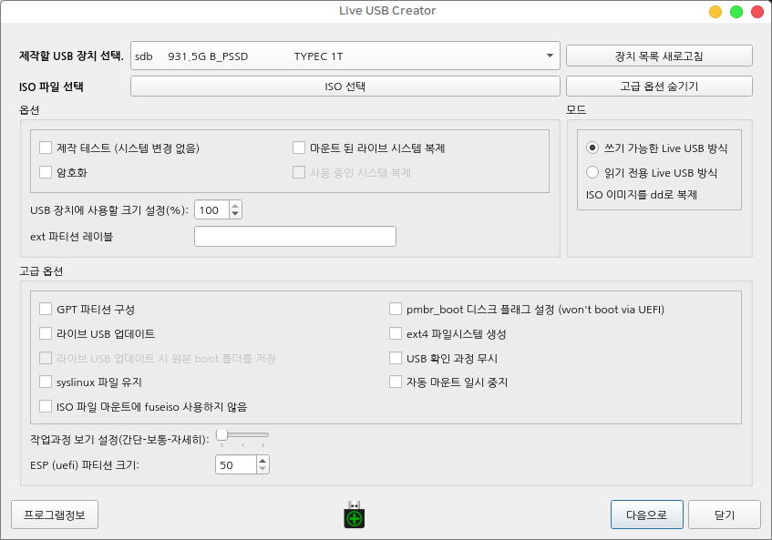
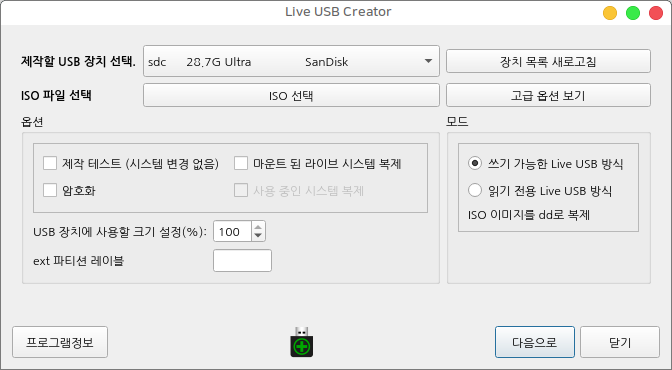
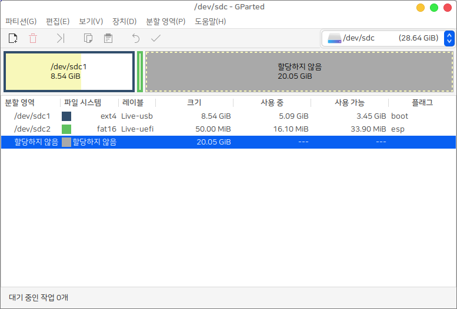
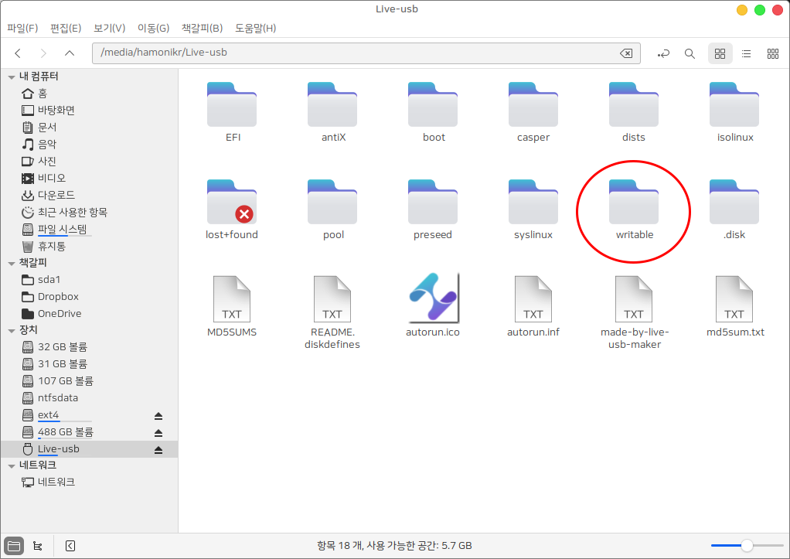

[English](#Live-USB-Creator) | [한국어](#라이브-USB-제작-도구)

# Live USB Creator

[한국어 바로가기](#라이브-USB-제작-도구)



## upstream projects

 * AppImage : https://github.com/MX-Linux/lum-qt-appimage
 * live-usb-maker CLI : https://github.com/BitJam/live-usb-maker
 * live-usb-maker-qt(GUI) : https://github.com/AdrianTM/mx-live-usb-maker

This program can create a writable live USB. So you don't waste space on the USB when creating a bootable USB from an ISO image.

This is a modified version of live-usb-maker used in the MXLinux project to be used in the latest Ubuntu.

A writable folder is created in the created USB, and data can be freely written in it.

You can specify the percentage of space on the USB to be used. (Remaining space can be used for other filesystems)

# Install

* Ubuntu (>=18.04), LinuxMint (>=19), any Ubuntu based Linux
```
# Add APT
curl -sL https://pkg.hamonikr.org/add-hamonikr.apt | sudo -E bash-

sudo apt update
sudo apt install live-usb-creator
```

 * Other OS

Using AppImage

 * AppImage : https://github.com/MX-Linux/lum-qt-appimage/releases/tag/19.11.02

You can grant execution permission to the downloaded file and use it as follows.

```
 sudo ./live-usb-maker-qt-19.11.02.x86_64.AppImage
```

# Usage

When you run the program, the following screen will appear.
(More settings available by selecting `Show advanced options` button)



1) Plug in USB and select a USB device to create bootable USB. If the attached USB is not displayed in the USB device list, click the `Refresh drive list` button to update the list.

2) Click the `Select ISO` button to select the desired ISO image.

3) You must select 'Writable Live USB method' to write data to USB. If you select'Read Only' here, it proceeds in the same way as making a normal bootable USB.

4) In `Percent of USB-device to use (%)`, enter the space you want to use for production as a percentage. The percentage remaining is created as unpartitioned space.

5) Click the `Next` button to proceed with live USB production. The process of creating a live writable USB takes slightly longer than the typical USB creation process.

6) If you check the contents of the USB that has been produced, a `writable` folder is created as shown in the following image, and you can freely read and write data.

<hr>

# 라이브 USB 제작 도구

[Go to English](#Live-USB-Creator)



ISO 이미지로 쓰기 가능한 라이브 USB를 제작하는 프로그램입니다.

- MXLinux 프로젝트에서 사용되는 live-usb-maker 를 하모니카에서 사용하도록 수정한 버전
- 제작된 USB 내 writable 폴더가 생기고 그 안에 자유롭게 데이터를 쓸 수 있습니다.
- 사용할 USB의 공간을 퍼센트로 지정할 수 있습니다. (남은 공간을 다른 파일시스템 용으로 사용 가능)

# Install

 * 지원 OS : 우분투 18.04 이상, 하모니카 3.0 이상

```
# Add APT
curl -sL https://pkg.hamonikr.org/add-hamonikr.apt | sudo -E bash-


sudo apt update
sudo apt install live-usb-creator
```

# Usage

## ISO 이미지로 쓰기 가능한 부팅 USB 제작하기

프로그램을 실행하면 다음과 같은 화면이 나타납니다.
(고급 옵션 보기를 선택하면 더 많은 설정 가능)



1) USB를 꼽고, 부팅 USB를 제작할 USB 장치를 선택합니다. 부착한 USB가 USB 장치 목록에 보이지 않는 경우 `장치 목록 새로고침` 버튼을 클릭하면 목록이 갱신됩니다.

2) `ISO 선택` 버튼을 클릭해서 원하는 ISO 이미지를 선택합니다.

3) `쓰기 가능한 Live USB 방식`을 선택해야 USB에 데이터를 쓸 수 있습니다. 만약 여기서 `읽기 전용`을 선택하면 일반적인 부팅 USB 제작과 동일한 방식으로 진행됩니다.

4) `USB 장치에 사용할 크기 설정(%)` 에서 제작에 사용하고 싶은 공간을 퍼센트로 입력합니다. 남은 퍼센트는 파티션이 할당되지 않은 공간으로 생성됩니다. 
- 30%로 설정한 경우 다음 이미지와 같은 파티션 구조로 USB가 제작됩니다.
- 남은 공간은 FAT32 또는 EXT4로 파티션을 구성해서 다른 운영체제에서 사용할 수 있습니다.
- 100%로 설정하면 ext4 파일시스템으로 전체 USB를 구성하고 쓰기 가능하게 만듭니다.



5) `다음으로` 버튼을 클릭하면 라이브 USB 제작이 진행됩니다. 쓰기 가능한 라이브 USB 제작 과정은 일반적인 USB 제작 과정보다 시간이 약간 더 소요됩니다.

6) 제작이 완료된 USB 안의 내용을 확인하면 다음 이미지와 같이 `writable` 폴더가 생성되며 데이터를 읽고 쓰는 것이 자유롭게 가능합니다.



## 라이브 USB 부팅 후 데이터 저장 

만약 위의 4번 과정에서 퍼센트를 수동으로 설정해서 USB 안에 빈 공간이 있는 경우에는 하모니카 라이브 USB 로 부팅을 한 상태에서 남은 빈 공간에 데이터를 저장할 수 있습니다. 
```
# 하모니카 라이브 USB로 부팅 후 터미널을 열고(Ctrl+Alt+T) 다음과 같이 실행
sudo mkdir /var/log/mydata
sudo chmod 777 /var/log/mydata
nemo /var/log/mydata
```
 - `/var/log/mydata` 안에 라이브 USB 상태에서 저장할 데이터를 저장하면 다른 PC에서 라이브 USB 부팅을 해도 데이터가 그대로 남습니다.

# Other OS

다른 OS 환경에서는 아래 AppImage 를 이용할 수 있습니다.

 * AppImage : https://github.com/MX-Linux/lum-qt-appimage/releases/tag/19.11.02

다운로드 받은 파일에 실행권한을 부여하고 다음과 같이 사용할 수 있습니다.
```
 sudo ./live-usb-maker-qt-19.11.02.x86_64.AppImage
```

## upstream projects

 * AppImage : https://github.com/MX-Linux/lum-qt-appimage
 * live-usb-maker CLI : https://github.com/BitJam/live-usb-maker
 * live-usb-maker-qt(GUI) : https://github.com/AdrianTM/mx-live-usb-maker

## Korean translation
 * https://github.com/chaeya/mx-live-usb-maker/blob/c9a50f331db561a7b3678fd9541a24e0c4280902/translations/mx-live-usb-maker_ko.ts

